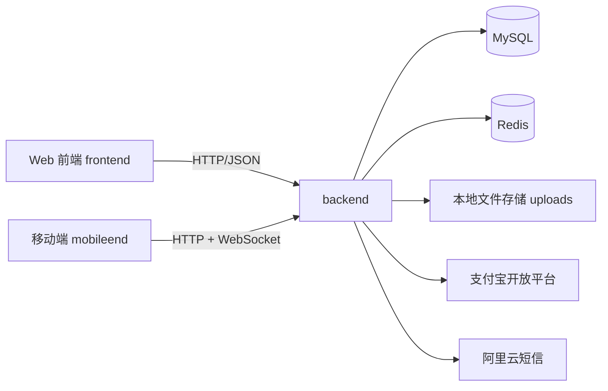

# 社区便民服务系统

本仓库包含三个子项目：
- `backend`：Spring Boot 后端
- `frontend`：Web 管理端（Vue3 + Element Plus）
- `mobileend`：移动端（Ionic Vue + Capacitor）

## 系统架构



## 核心功能

- 账号体系：账号密码登录、短信验证码登录、JWT 鉴权、角色控制（ADMIN/EMPLOYEE/USER）
- 人员管理：用户信息维护、头像上传、按角色管理
- 便民服务：服务发布、审核、上下架、预约、评价
- 物业报修：工单提交、图片上传、流程流转、备注与进度图、状态回退
- 电费代缴：电费订单创建、支付状态刷新、支付宝回调、生活缴费跳转
- 邻里圈与聊天：朋友圈动态、评论/回复、好友、私聊、群聊、群公告、群公告确认、群消息免打扰
- 实时能力：在线用户维护、离线消息入 Redis 并补拉、WebSocket 实时推送

## 角色与可见范围

- `USER`：查看和处理自己的报修工单；使用便民、邻里圈、聊天等用户功能
- `EMPLOYEE`：可查看全量报修工单并处理流程；可使用服务提供方功能
- `ADMIN`：可查看全量报修工单；拥有审核与系统管理能力

报修工单规则：
- 管理员/员工：默认查看全量工单
- 普通用户：仅查看自己的工单

## 项目结构

```text
.
├─ backend      # Spring Boot + MyBatis + MySQL + Redis + WebSocket
├─ frontend     # Web 管理端（保留原有实现）
└─ mobileend    # Ionic Vue + Capacitor 移动端
```

## 快速启动

### 1. 环境准备

- JDK 8+
- Maven 3.8+
- MySQL 8.x
- Redis 6.x/7.x
- Node.js 18+

### 2. 初始化数据库

创建数据库：

```sql
CREATE DATABASE community_app DEFAULT CHARACTER SET utf8mb4;
```

说明：
- `backend` 启动时会自动执行 `schema.sql` 建表和部分迁移逻辑
- 演示账号数据请手动执行 `backend/src/main/resources/data.sql`

### 3. 启动后端

```bash
cd backend
mvn spring-boot:run
```

默认端口：`8080`

### 4. 启动 Web 前端（可选）

```bash
cd frontend
npm install
npm run dev
```

### 5. 启动移动端

```bash
cd mobileend
npm install
npm run dev
```

Android 打包参考 [mobileend/README.md](./mobileend/README.md)。

## 配置说明

后端配置文件：`backend/src/main/resources/application.yml`

重点配置项：
- 数据库：`spring.datasource.*`
- Redis：`spring.redis.*`
- JWT：`jwt.secret`、`jwt.expiration`
- 短信：`sms.*`
- 支付宝：`alipay.*`
- 上传目录：`repair.upload-dir`、`service-platform.upload-dir`、`social.upload-dir`

移动端配置文件：`mobileend/.env`

```env
VITE_API_BASE_URL=http://10.0.2.2:8080/api
VITE_WS_BASE_URL=ws://10.0.2.2:8080
```

使用 ngrok 时请改为你的公网地址，例如：
- `VITE_API_BASE_URL=https://xxxx.ngrok-free.dev/api`
- `VITE_WS_BASE_URL=wss://xxxx.ngrok-free.dev`

## 默认测试账号（执行 data.sql 后）

- 管理员：`admin / admin123`
- 员工：`employee / employee123`
- 用户：`user / user123`

## Git 上传建议

当前 `.gitignore` 已忽略以下无需上传内容：
- 构建产物（`target/`、`dist/`、`build/`）
- 依赖目录（`node_modules/`）
- 本地环境文件（`.env*`，保留 `.env.example`）
- Android/iOS 本地编译缓存
- 运行时上传目录（`uploads/`、`temp/`）

如果某些文件已被 Git 跟踪，需要先取消跟踪再提交：

```bash
git rm -r --cached <path>
```
