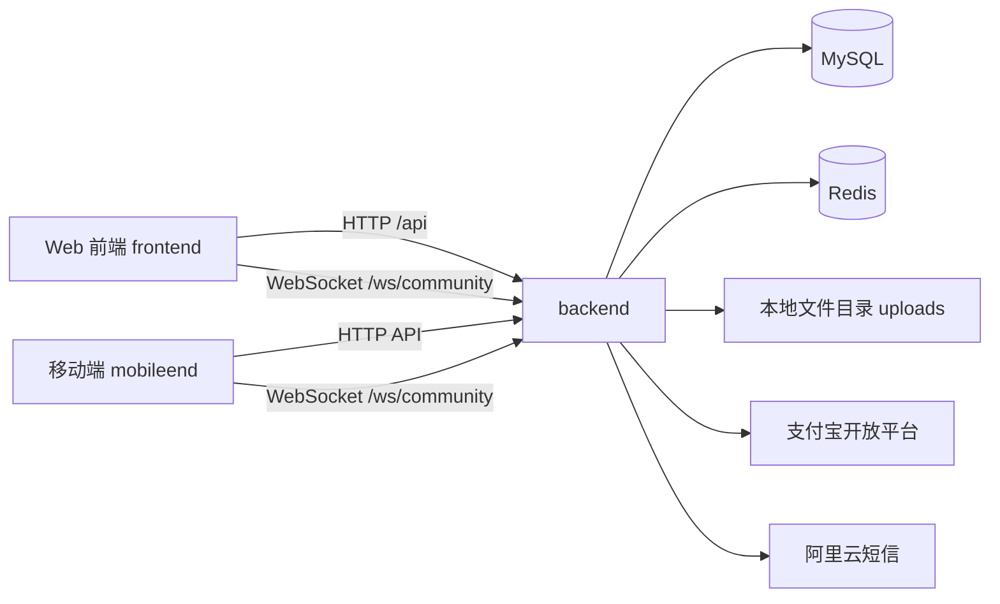

# 社区便民服务系统

一个覆盖 **Web 端 + 移动端 + Spring Boot 后端** 的社区服务平台，围绕社区住户、员工和管理员提供统一的账号体系、便民服务、物业报修、电费代缴、邻里圈、聊天和实时通知能力。

## 1. 项目总览

本仓库包含三个子项目：

- [`backend`](./backend/README.md)：Spring Boot 后端，提供 REST API、WebSocket、鉴权、数据库访问、支付和短信集成。
- [`frontend`](./frontend/README.md)：Vue 3 + Element Plus Web 客户端，面向住户、员工和管理员的综合页面端。
- [`mobileend`](./mobileend/README.md)：Ionic Vue + Capacitor 移动端，面向移动场景的住户与管理端能力。

三端共用同一套业务后端，其中：

- Web 端通过 `/api` 和 `/ws/community` 访问后端。
- 移动端通过环境变量指定 REST 与 WebSocket 地址。
- 后端同时连接 MySQL、Redis、本地上传目录、支付宝和阿里云短信。

## 2. 核心功能地图

系统当前覆盖以下业务域：

### 2.1 认证与账号体系

- 用户注册
- 账号密码登录
- 手机验证码登录
- JWT 登录态
- 角色区分：`USER` / `EMPLOYEE` / `ADMIN`

### 2.2 人员管理

- 当前用户资料查看
- 用户列表查询
- 用户新增、修改、删除
- 头像上传

### 2.3 便民服务平台

- 服务分类查询
- 服务入驻申请
- 服务审核
- 服务运营状态管理
- 服务浏览
- 服务预约
- 服务评价

### 2.4 物业报修

- 报修工单提交
- 图片上传
- 工单列表与详情
- 工单流程流转
- 备注与进度图
- 用户确认完成

### 2.5 电费代缴

- 默认账单信息展示
- 电费订单创建
- 支付二维码/支付链接
- 支付状态刷新
- 支付宝异步回调

### 2.6 邻里圈

- 发布动态
- 动态图片上传
- 评论与回复
- 动态实时更新

### 2.7 聊天与实时能力

- 在线用户列表
- 好友关系
- 私聊
- 群聊
- 群公告与确认
- 群消息免打扰
- 离线消息入 Redis 并补拉
- 本地通知（移动端）

## 3. 系统架构



### 3.1 各组件职责

| 组件 | 主要职责 |
| --- | --- |
| `backend` | 提供业务接口、实时推送、鉴权、数据库与第三方整合 |
| `frontend` | 浏览器端页面、角色化功能入口、管理能力与住户能力 |
| `mobileend` | 移动端页面、实时通知、Android 打包与真机联调 |
| MySQL | 保存用户、服务、工单、订单、聊天、社交数据 |
| Redis | 缓存业务数据、短信间隔控制、离线消息队列 |
| uploads | 保存报修、服务、邻里圈和聊天图片 |
| 支付宝 | 电费代缴支付与状态查询 |
| 阿里云短信 | 发送验证码 |

## 4. 仓库结构

```text
.
├─ backend      # Spring Boot 后端
├─ frontend     # Vue 3 + Element Plus Web 端
└─ mobileend    # Ionic Vue + Capacitor 移动端
```

## 5. 角色矩阵

系统当前主要区分三种角色：

### 5.1 `USER`

主要面向住户：

- 登录、注册
- 便民服务浏览、预约、评价
- 提交和查看自己的报修工单
- 电费代缴
- 邻里圈
- 聊天
- 个人中心

### 5.2 `EMPLOYEE`

主要面向社区员工：

- 查看和处理更广范围的报修工单
- 服务入驻管理
- 人员管理
- 邻里圈与聊天
- 个人中心

### 5.3 `ADMIN`

主要面向管理员：

- 拥有员工的全部能力
- 服务入驻审核
- 人员管理
- 系统管理类能力
- 电费代缴页面权限

## 6. 子项目说明

### 6.1 backend

后端负责：

- `/api/auth/*`：认证
- `/api/users/*`：用户与头像
- `/api/repair/*`：物业报修
- `/api/services/*`：便民服务、入驻、审核、预约、评价
- `/api/electricity/*`：电费代缴
- `/api/social/*`：社交/聊天图片上传与访问
- `/ws/community`：邻里圈、好友、群聊、私聊和在线状态的实时通道

详细说明见 [backend/README.md](./backend/README.md)。

### 6.2 frontend

Web 端主要页面：

- 登录 / 注册
- 首页
- 便民服务
- 服务入驻
- 入驻审核
- 物业报修
- 电费代缴
- 邻里圈
- 聊天 / 聊天室
- 我的
- 人员管理

详细说明见 [frontend/README.md](./frontend/README.md)。

### 6.3 mobileend

移动端主要页面：

- 登录 / 注册
- 首页
- 便民服务
- 物业报修
- 邻里圈
- 聊天 / 聊天室
- 电费代缴
- 服务入驻
- 入驻审核
- 人员管理
- 我的

详细说明见 [mobileend/README.md](./mobileend/README.md)。

## 7. 配置矩阵

### 7.1 后端配置

主配置文件：[`backend/src/main/resources/application.yml`](./backend/src/main/resources/application.yml)

| 分类 | 配置项 | 作用 |
| --- | --- | --- |
| 服务 | `server.port` | 后端端口 |
| 数据库 | `spring.datasource.*` | MySQL 连接信息 |
| Redis | `spring.redis.*` | Redis 主机、端口、库号、超时 |
| JWT | `jwt.secret`、`jwt.expiration` | 登录态签名与过期时间 |
| 短信 | `sms.*` | 阿里云短信参数 |
| 支付宝 | `alipay.*` | 电费代缴支付参数与回调地址 |
| 上传目录 | `repair.upload-dir`、`service-platform.upload-dir`、`social.upload-dir` | 本地文件保存路径 |
| 上传大小 | `*.max-file-size-mb` | 各业务上传大小限制 |

### 7.2 Web 端配置

Web 端当前没有单独的 API 地址环境变量，核心依赖：

- [frontend/src/api/request.js](./frontend/src/api/request.js) 中的 `/api`
- [frontend/src/composables/useDesktopSocial.js](./frontend/src/composables/useDesktopSocial.js) 中的当前站点 `/ws/community`
- [frontend/vite.config.js](./frontend/vite.config.js) 中开发环境代理

这意味着：

- **开发环境**：通过 Vite 代理访问后端。
- **生产环境**：需要由反向代理把 `/api` 和 `/ws` 转发到后端。

### 7.3 移动端配置

环境变量示例文件：[`mobileend/.env.example`](./mobileend/.env.example)

```env
VITE_API_BASE_URL=http://10.0.2.2:8080/api
VITE_WS_BASE_URL=ws://10.0.2.2:8080
```

| 变量 | 作用 |
| --- | --- |
| `VITE_API_BASE_URL` | 指定移动端 REST API 基础地址 |
| `VITE_WS_BASE_URL` | 指定移动端 WebSocket 基础地址 |

## 8. 本地快速启动

### 8.1 环境准备

- JDK 8+
- Maven 3.8+
- MySQL 8.x
- Redis 6.x / 7.x
- Node.js 18+
- npm 9+
- Android Studio（仅移动端打包时需要）

### 8.2 初始化数据库

先创建数据库：

```sql
CREATE DATABASE community_app DEFAULT CHARACTER SET utf8mb4;
```

说明：

- 后端启动时会执行 `schema.sql` 建表。
- 如需演示账号，可手动执行 [`backend/src/main/resources/data.sql`](./backend/src/main/resources/data.sql)。

### 8.3 启动后端

```bash
cd backend
mvn spring-boot:run
```

默认端口：`8080`

### 8.4 启动 Web 端

```bash
cd frontend
npm install
npm run dev
```

默认开发端口：`5173`

### 8.5 启动移动端

```bash
cd mobileend
npm install
npm run dev
```

启动前请先复制 `.env.example` 为 `.env` 并填写后端地址。

## 9. 完整部署说明

### 9.1 部署顺序建议

推荐顺序：

1. 准备 MySQL
2. 准备 Redis
3. 配置后端 `application.yml`
4. 初始化数据库
5. 部署后端
6. 构建并部署 Web 前端
7. 配置移动端环境变量并打包
8. 验证图片上传、WebSocket、支付回调与短信能力

### 9.2 后端部署

后端至少需要：

- 可用的 MySQL
- 可用的 Redis
- 持久化上传目录
- 合法的 JWT Secret
- 如启用电费代缴，需准备支付宝配置
- 如启用短信登录，需准备阿里云短信配置

后端打包命令：

```bash
cd backend
mvn -DskipTests package
```

### 9.3 Web 前端部署

Web 端构建命令：

```bash
cd frontend
npm install
npm run build
```

部署要求：

- 将构建产物部署到静态 Web 服务器。
- 反向代理 `/api` 到后端服务。
- 反向代理 `/ws/community` 对应的 `/ws` 升级请求到后端。

### 9.4 移动端打包

移动端打包命令：

```bash
cd mobileend
npm install
npm run build
npm run cap:add:android
npm run cap:sync
npm run cap:android
```

如果 Android 工程已经创建，后续通常执行：

```bash
npm run build
npm run cap:sync
npm run cap:android
```

### 9.5 WebSocket 与文件访问

部署后必须确保以下能力都可达：

- `/ws/community` 可以成功升级为 WebSocket 连接
- `/api/repair/file`
- `/api/services/file`
- `/api/social/file`

否则会直接影响：

- 聊天实时性
- 邻里圈实时更新
- 报修/服务/动态图片回显

### 9.6 支付回调与公网地址

如果启用支付宝电费代缴：

- `alipay.notify-url` 必须配置为公网可访问地址
- 地址需要能被支付宝服务器主动访问
- 如果只在本地开发，可使用 ngrok 等工具临时暴露公网地址

## 10. 构建与发布

### 10.1 后端

- 本地运行：`mvn spring-boot:run`
- 打包：`mvn -DskipTests package`

### 10.2 Web 端

- 开发：`npm run dev`
- 构建：`npm run build`
- 预览：`npm run preview`

### 10.3 移动端

- 开发：`npm run dev`
- 构建：`npm run build`
- 同步 Android：`npm run cap:sync`
- 打开 Android Studio：`npm run cap:android`

## 11. 演示账号说明

执行 [`backend/src/main/resources/data.sql`](./backend/src/main/resources/data.sql) 后，会导入以下演示用户名：

- `admin`
- `employee`
- `user`

如需用于正式环境，请自行重置密码、手机号与权限数据，不要直接保留演示数据。

## 12. 生产环境注意事项

上线前建议至少确认以下事项：

- 替换默认数据库密码。
- 替换默认 JWT Secret。
- 检查 `alipay.notify-url` 是否使用真实公网地址。
- 检查上传目录是否挂载到持久化存储。
- 检查 WebSocket 代理是否正确支持升级连接。
- 真机和公网环境优先使用 `https` / `wss`。
- 决定是否保留 `data.sql` 演示账号。
- 检查 Redis 是否稳定可用，否则离线消息与缓存行为会受影响。

## 13. 当前实现上的几个重要事实

- Web 端当前采用 **同源 `/api` + `/ws/community`** 的接入方式，而不是通过前端环境变量动态切换后端地址。
- 移动端当前采用 **环境变量配置 API 与 WebSocket 地址** 的接入方式。
- 后端代码中实现了 **Shiro + JWT** 鉴权链，但 `application.yml` 里当前 `shiro.enabled` 等配置为 `false`，实际启用状态取决于你运行时的配置。
- 社交与聊天核心交互主要依赖 `/ws/community`，`/api/social/*` 只负责图片上传与图片访问。

## 14. 文档导航

- [后端说明](./backend/README.md)
- [Web 端说明](./frontend/README.md)
- [移动端说明](./mobileend/README.md)
